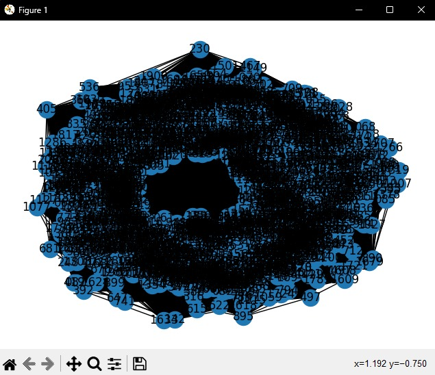
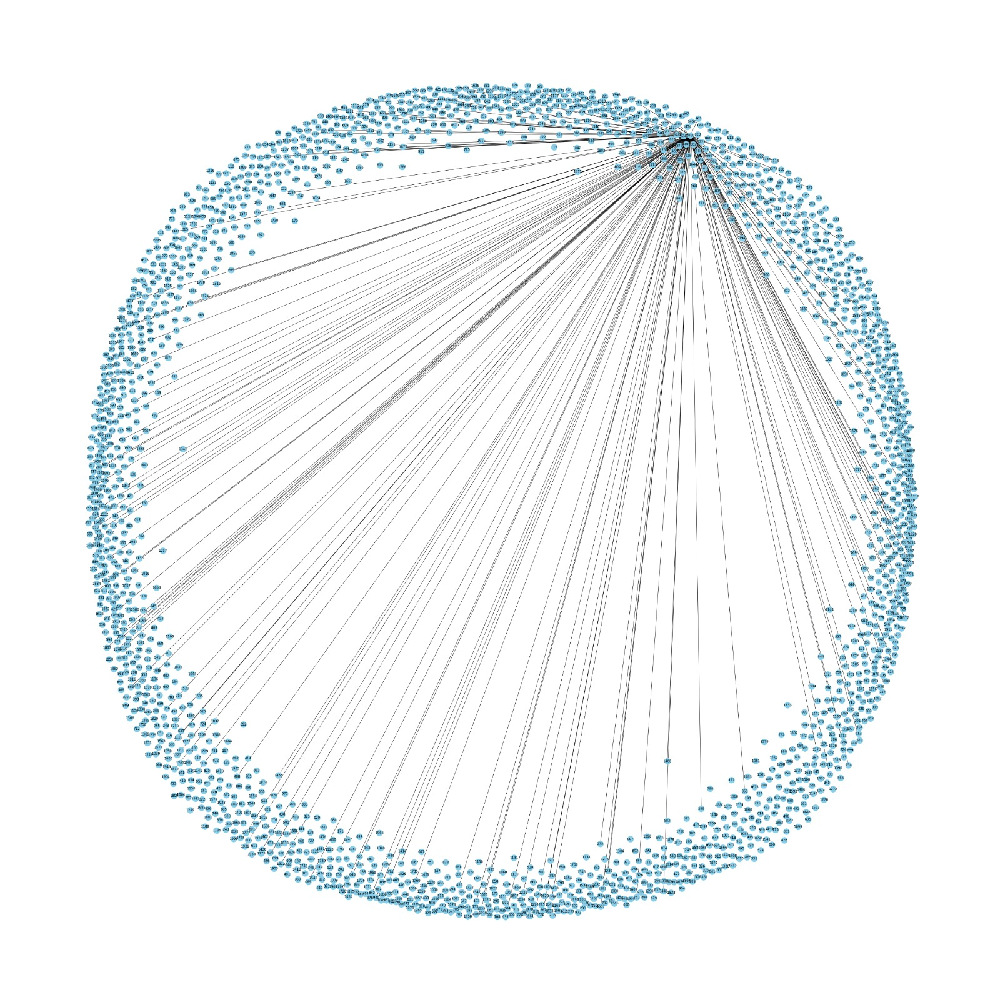

# TP_Complejidad_Algoritmica

#### Sección:
WX72
#### Profesor: 
Carnaval Sanchez, Luis Martin
#### Integrantes:

- Ccotarma Ttito, Sihuar Eduardo U20211c736
- Iparraguirre Rueda, Cristian Luis U202113111
- Quispe Condori, Fernando Daniel U20221C628
- Alonso Garay, Diego Jesus U20221D014

## Titulo del Proyecto: 
Netminig

## Índice
- [TF\_Complejidad\_Algoritmica](#tf_complejidad_algoritmica)
      - [Sección:](#sección)
      - [Profesor:](#profesor)
      - [Integrantes:](#integrantes)
  - [Titulo del Proyecto:](#titulo-del-proyecto)
  - [Índice](#índice)
  - [Descripción del Problema](#descripción-del-problema)
  - [Propuesta de Solucion](#propuesta-de-solucion)
    - [Estructura de los Datos](#estructura-de-los-datos)
  - [Diseño del aplicativo](#diseño-del-aplicativo)
  - [Validacion de resultados y pruevas](#validacion-de-resultados-y-pruevas)
    - [Ejemplo esperado](#ejemplo-esperado)
  - [Conclucion](#conclucion)

## Descripción del Problema
Hoy en día, se lanzan al mercado una gran variedad de videojuegos con estilos, géneros
y mecánicas diversos. Esta amplia gama de preferencias está generando una división cada
vez mayor entre las comunidades de jugadores. Cada jugador tiene sus propios gustos y
preferencias en cuanto a los tipos de juegos que prefiere. Mientras algunos disfrutan de
juegos de rol (RPG), otros prefieren los juegos de disparos (FPS), y hay quienes se inclinan
por los juegos de estrategia o de aventuras. Esta diversidad puede dificultar que una persona
encuentre compañeros para jugar un juego específico cuando lo desea. Según un reporte de Infobae,2020, la comunidad gamer hoy en día es más separado lo que lleva a
este problema descrito. Es por ello que en el presente proyecto detallaremos de que manera
con los conocimientos podemos ayudar a solucionar este problema.
## Propuesta de Solucion
Un sistema de recomendaciones de "amistad" en una red social enfocado en personas con gustos similares
por videojuegos, podemos adaptar el uso del algoritmo BFS (Búsqueda en Anchura) para descubrir y sugerir
nuevas conexiones basadas en intereses compartidos. Este tipo de sistema puede ayudar a los usuarios a
encontrar otras personas con quienes tengan mucho en común, especialmente en términos de videojuegos
favoritos, estilos de juego, y otras preferencias relacionadas.

### Estructura de los Datos
*Nodos*: Cada nodo representa a un usuario de la red social. Estos nodos se encuentran en nuestro
repositorio de github en el archivo dataset.json.

Los nodos contendrán la siguiente información:

- ***ID***: Identificador único para cada usuario.
- ***Nombre del Usuario***: Representa el nombre del usuario de la red social.
- **_Videojuegos favoritos_**: Lista de videojuegos que el usuario ha marcado como favoritos.
- **_Géneros preferidos_**: Lista de géneros de videojuegos que el usuario disfruta más.
- **_Plataformas de juego_**: Indica las plataformas de juego que el usuario utiliza (PC, consola, móvil, etc.).

***Aristas***: Representan las conexiones (amistades) existentes entre los usuarios. Las aristas son no ponderadas en este caso, ya que simplemente representan la existencia de una conexión directa. Estas aristas se generan bajo ciertas circunstancias que el grafo por el momento solo cumpliendo ciertas condiciones.

## Diseño del aplicativo

El algoritmo BFS se utilizará para explorar la red y encontrar conexiones basadas en intereses comunes de la siguiente manera:

1. *Inicialización*:
    - Selecciona un usuario inicial (puede ser el usuario que ha iniciado sesión en la red social y busca nuevas conexiones).
    - Marca este usuario como visitado y agrégalo a una cola.

2. *Exploración de conexiones*:
    - Mientras la cola no esté vacía:
        - Extrae el primer usuario de la cola.
        - Para cada amigo (vecino) de este usuario:
            - Si no ha sido visitado:
                - Marca al amigo como visitado.
                - Comprueba los intereses compartidos en videojuegos:
                    - Si tienen un número significativo de videojuegos o preferencias en común, considera esta conexión como una recomendación potencial.
                - Agrega este amigo al final de la cola.

3. *Recomendación*:
    - Recopila todas las conexiones donde se encontraron intereses compartidos significativos.
    - Sugerir estas conexiones como potenciales nuevos amigos al usuario inicial.
    - Establecer una versión propia de nuestro algoritmo para que pueda ser implementado en la red social.
      De manera que el algoritmo BFS se adapte a las necesidades de la red social y pueda sugerir conexiones relevantes y significativas para los usuarios.

## Validacion de resultados y pruebas:
En esta entrega por el momento las aristas han sido pre definidas por ciertos parametros ya pre establecidos por los integrantes del grupo. Algunos ejemplos y pruebas que se realizaron son:

1. *La arista se genera cuando un usuario y otro tienen un juego en común*:

2. *La arista se genera cuando un usuario y otro tienen dos juegos en común*:

3. *La arista se genera cuando un usuario y otro tienen tres juegos y dos plataforma en común*:

### Ejemplo esperado

Supongamos que tenemos un pequeño grupo de usuarios y estos deban encontrar otros usuarios con el cual comparten un juego en común para unirse:

## Conclusión
La propuesta de implementar un sistema de recomendaciones de amistad basado en intereses comunes en videojuegos dentro de una red social es una solución prometedora para abordar la dificultad que enfrentan los jugadores al encontrar compañeros para jugar. Al adaptar el algoritmo BFS, se puede explorar de manera eficiente la red social y sugerir nuevas conexiones basadas en afinidades en juegos. Esta solución no solo facilita la búsqueda de amigos con intereses similares, sino que también puede enriquecer la experiencia social de los usuarios al conectarlos con personas con quienes comparten pasiones específicas. Además, la validación de resultados mediante un ejemplo práctico demuestra la viabilidad y eficacia potencial de este enfoque. En resumen, la implementación de este sistema podría mejorar significativamente la interacción y la satisfacción de los usuarios en la red social, fortaleciendo así la comunidad de jugadores en línea.

## Referencias Bibliográficas:

- Infobae. (2020, 29 enero). El público de gamers es cada vez más diverso: ¿por qué los videojuegos no? Infobae. https://www.infobae.com/america/tecno/2020/01/29/el-publico-de-gamers-es-cada-vez-mas-diverso-por-que-los-videojuegos-no/
- Canning, J., Broder, A., & Lafore, R. (s. f.). Data Structures & Algorithms in Python. O’Reilly Online Learning. https://learning.oreilly.com/library/view/data-structures/9780134855912/